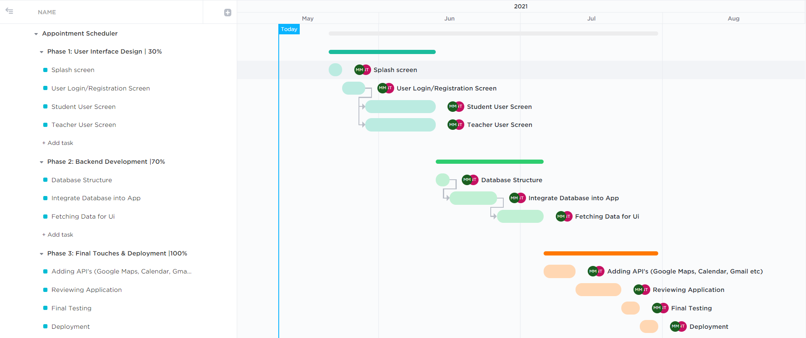

# appointment_scheduler
Expected Project Timeline
=========================

For better view click [here](https://sharing.clickup.com/g/h/4-5913085-7/7b4763f58e1af03)

## Report on Learning Pre-requisites
-------------------------------------

SL | Learning Task | Description | Status | Comment |
--:|:-------------:|:-----------:|:------:|:-------:|
1  | Flutter       | Flutter Widgets, Dart Language |   | |
2 | Firebase | Authentication, Real-Time Database, Data Fetching |    | |
3 | API's | Google Maps, Google Calender, Gmail |  | |
4 | Push Notifications | Alarm, In-device Notification |  | |

# Used Technologies
 * Dart
 * Flutter
 * Google Firebase :
     * Firebase Authentication
     *  Cloud Firestore
     * Firebase Storage
 * Github
 * Dependencies:        
     *  intl: ^0.17.0       
     *  date_format: ^2.0.2
     *  provider: ^6.0.1
     *  animations: ^2.0.2
     *  table_calendar: ^3.0.3
     *  image_picker: ^0.8.4+4
     *  http: ^0.13.4
     *  cupertino_icons: ^1.0.4
     *  firebase_auth: ^3.3.0
     *  cloud_firestore: ^3.1.1
     *  fluttertoast: ^8.0.8
     *  flutter_speed_dial: ^4.6.6
     *  geolocator: ^8.0.0
     *  google_maps_flutter: ^2.1.0
     *  url_launcher: ^6.0.17 
     *  flutter_local_notifications: ^9.0.0
     *  rxdart: ^0.27.2
     *  flutter_native_timezone: ^2.0.0
     *  firebase_storage: ^10.2.4
     *  file_picker: ^4.3.0
     *  email_auth: ^1.0.0
     *  barcode_widget: ^2.0.2
     *  flutter_barcode_scanner: ^2.0.0
     *  path_provider: ^2.0.8  
     *  wc_flutter_share: ^0.4.0
     *  dropdown_button2: ^1.0.7
    

# Functionalities
 ## Implemented
      * User Authentication  
           Contributor: Nazmun Nahar Tui
      * Email Verification  
           Contributor: Nazmun Nahar Tui
      * Enabling Account by Moderator  
           Contributor: Nazmun Nahar Tui
      * Get Connected With The Teachers Scanning QR Code   
           Contributor: Nazmun Nahar Tui
      * Create Pre-Scheduled Appointment  
           Contributor: Nazmun Nahar Tui
      * Change Password  
           Contributor: Nazmun Nahar Tui
      * Upload Profile Picture  
           Contributor: Nazmun Nahar Tui
      *  Create Instant Appointment  
           Contributor: Muhit Mahmud Al Farhan
      * Show Location Of Students In Maps Who Requested for Appointments  
           Contributor: Muhit Mahmud Al Farhan
      * Turning Active Status On By Teachers  
           Contributor: Muhit Mahmud Al Farhan
      * Filtering Appointmnets  
           Contributor: Muhit Mahmud Al Farhan
      * Local Notification  
           Contributor: Muhit Mahmud Al Farhan
      * Call Functionality  
           Contributor: Muhit Mahmud Al Farhan
      
 ##  Unimplemented
      * Setting Events in Google Calendar  
      * Changing Themes  
      * Show Routes of the Students In Map(Due to Financial Issue)  
      
  
# Acknowledgement
 * **Enamul Hasan**  
      Assistant Professor  
      Department of Computer Science & Engineering, SUST  
      
      **Contribution :**  
           He is our respectful course teacher.The idea of the project was suggested by him. We have been regularly supervised by him.He reviewed our project several times
           and helped us to improve our application.

# Developers
      Group Number : 05
      Group Name : Team Twain
      Group Members
          * Nazmun Nahar Tui
           Email: nazmun47@student.sust.edu
           Cell :+8801865555340
           Registration :2018331047
           
          * Muhit Mahmud Al Farhan
           Email: muhitmahmud404@gmail.com
           Cell :+8801792395655
           Registration :2018331113

\
\
<small>&copy;2021 - Dept. of CSE, SUST, BD</small>
     
   
     
